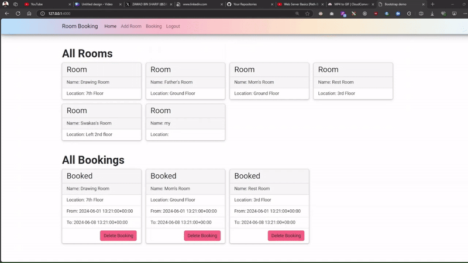

## Room Booking Website Demo Video



## Get Started the project
First, create a virtual environment: 
```bash
python -m venv .venv
````
Second, run the virtual environment python:

- for powershell
```bash
 .\.venv\Scripts\Activate.ps1 
```

- for cmd
```bash
 .\.venv\Scripts\activate.bat
```

- for bash
```bash
 .\.venv\Scripts\activate
```


Third, install all required packages:
```bash
pip install -r .\requirements.txt
```

Last, run the main.py file:
```bash
python main.py
```